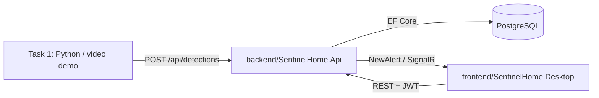

# SentinelHome — kiến trúc triển khai

## Ranh giới frontend/backend

```
frontend/SentinelHome.Desktop     Task 3: WPF + MVVM + HttpClient + SignalR client
backend/SentinelHome.Api          Task 2: ASP.NET Core Minimal API + JWT + SignalR hub
backend/SentinelHome.Data         Entity Framework Core + PostgreSQL; chỉ backend được tham chiếu
shared/SentinelHome.Contracts     DTO/enum truyền qua REST và SignalR; không chứa DbContext
```

WPF không có project reference tới `SentinelHome.Data`; nó chỉ nhận DTO từ `SentinelHome.Contracts` qua HTTP/SignalR. Đây là ranh giới bắt buộc giữa frontend và backend.

## Luồng hiện tại



## Thứ tự thực hiện

1. Hoàn thiện `DetectionIngestService`: parse JSON, đổi giờ Việt Nam sang UTC, đối chiếu watchlist, debounce và lưu event.
2. Thêm `AuthService`/JWT và endpoint login.
3. Triển khai endpoint event, species, alert-settings và dashboard theo `SentinelHome_Task2_API_Design.md`.
4. Hoàn thiện WPF theo thứ tự: login → shell/dashboard → history/detail → settings → SignalR popup.

## Quy tắc thiết kế

- DTO là `sealed record`; entity EF Core không trả thẳng ra API.
- Date/time ở API và database dùng `DateTimeOffset`/UTC.
- Enum được chuyển thành string trong JSON khi cấu hình API endpoint.
- Ảnh BLOB chỉ tải khi xem chi tiết; lịch sử không kéo `ImageData`.
- Các API mutation sử dụng JWT; riêng health, login và ingest là anonymous trong phạm vi demo.
