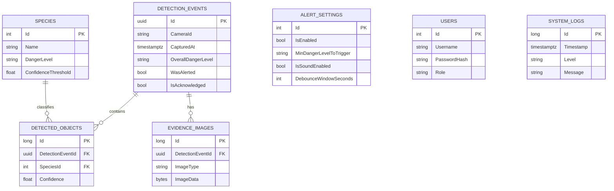

# SentinelHome — Thiết kế Database

**Môn học:** Lập trình trực quan (C# / .NET)
**Công nghệ:** PostgreSQL + Entity Framework Core (Code First)
**Phiên bản:** v2 — sau khi review kiến trúc (xem mục 8)

## 1. Bối cảnh & ràng buộc thiết kế

- Đồ án làm trên lớp, **chỉ dùng 1 camera** (demo bằng video, không phải camera thật).
- Hệ thống **chỉ cảnh báo qua popup** trên desktop app — không dùng Telegram/Email.
- 1 sự kiện phát hiện (1 lần nhận JSON từ Task 1) **có thể chứa nhiều vật thể** trong cùng khung hình.
- Ảnh bằng chứng được lưu **trực tiếp dạng BLOB** trong PostgreSQL (không lưu path file).
- Có thêm 3 chức năng mở rộng: **đăng nhập/phân quyền**, **log lịch sử cảnh báo** (đã gộp vào bảng sự kiện), **nhật ký lỗi hệ thống**.

Kết quả: **7 bảng**. Không có bảng `Cameras` (vì chỉ 1 camera), không có `AlertChannelConfigs`/`AlertLogs` riêng (vì chỉ còn popup).

## 2. Sơ đồ quan hệ (ERD)



## 3. Chi tiết từng bảng

### 3.1. `Species` — Danh sách loài nguy hiểm (watchlist)

| Cột | Kiểu | Ghi chú |
|---|---|---|
| Id | int (PK) | |
| Name | string, unique | Tên loài đúng như model phân loại trả về, vd "king snake" |
| DisplayNameVi | string, nullable | Tên tiếng Việt hiển thị trên UI |
| DangerLevel | enum (Low / Medium / High) | |
| ConfidenceThreshold | float | Ngưỡng confidence tối thiểu để tính là phát hiện hợp lệ |
| IsActive | bool | |

### 3.2. `DetectionEvents` — Sự kiện phát hiện

1 sự kiện = 1 lần nhận JSON từ Task 1 (ứng với 1 khung hình tại 1 thời điểm).

| Cột | Kiểu | Ghi chú |
|---|---|---|
| Id | Guid (PK) | |
| CameraId | string | Định danh nguồn dữ liệu (vd "cam01"); không bắt buộc phải là camera vật lý — dùng được cả khi demo bằng video |
| CapturedAt | timestamptz | Trường "time" trong JSON gốc — **luôn lưu UTC**, xem quy ước ở mục 8 |
| ReceivedAt | timestamptz | Thời điểm hệ thống C# nhận & xử lý — luôn UTC |
| OverallDangerLevel | enum (Low / Medium / High) | Mức nguy hiểm cao nhất trong các vật thể của sự kiện — lưu sẵn để lọc/thống kê nhanh |
| IsDuplicate | bool | True nếu bị xác định trùng lặp (phục vụ debounce) |
| OriginalEventId | Guid?, FK → DetectionEvents (self) | Trỏ về sự kiện gốc nếu IsDuplicate = true |
| WasAlerted | bool | Đã hiện popup cảnh báo chưa |
| AlertedAt | timestamptz? | Thời điểm popup được hiện |
| IsAcknowledged | bool | Người dùng đã xem/tắt popup chưa |
| AcknowledgedAt | timestamptz? | |

### 3.3. `DetectedObjects` — Vật thể trong 1 sự kiện

Tách riêng khỏi `DetectionEvents` vì 1 khung hình có thể chứa nhiều vật thể/bounding box cùng lúc.

| Cột | Kiểu | Ghi chú |
|---|---|---|
| Id | long (PK) | |
| DetectionEventId | Guid, FK → DetectionEvents | Cascade delete |
| SpeciesId | int?, FK → Species | Nullable — model có thể trả về loài chưa có trong watchlist |
| SpeciesNameRaw | string | Tên loài gốc lấy thẳng từ JSON, luôn lưu (audit trail) |
| Confidence | float | |
| BBoxX, BBoxY, BBoxWidth, BBoxHeight | int | Tọa độ bounding box (pixel) |
| IsDangerMatch | bool | True nếu khớp watchlist VÀ vượt ngưỡng confidence của Species đó |

### 3.4. `EvidenceImages` — Ảnh bằng chứng (BLOB)

| Cột | Kiểu | Ghi chú |
|---|---|---|
| Id | long (PK) | |
| DetectionEventId | Guid, FK → DetectionEvents | Cascade delete |
| ImageType | enum (FullFrame / Cropped) | |
| ImageData | byte[] → cột `bytea` | Nên nén/resize ảnh (vd giới hạn ~1280px, JPEG 80%) trước khi lưu |
| ContentType | string | vd "image/jpeg" |
| CreatedAt | timestamptz | |

> **Ghi chú chưa xử lý**: hiện bảng này chưa có cột trỏ tới `DetectedObject` cụ thể — nếu 1 sự
> kiện có nhiều vật thể và mỗi vật thể có 1 ảnh crop riêng, chưa phân biệt được ảnh nào ứng với
> con vật nào. Cân nhắc thêm cột `DetectedObjectId` (int?, FK) nếu cần chính xác đến mức đó.

### 3.5. `AlertSettings` — Cấu hình popup cảnh báo

Chỉ nên có **đúng 1 dòng** dữ liệu (singleton).

| Cột | Kiểu | Ghi chú |
|---|---|---|
| Id | int (PK) | Luôn = 1 |
| IsEnabled | bool | Bật/tắt popup |
| MinDangerLevelToTrigger | enum (Low / Medium / High) | Ngưỡng nguy hiểm tối thiểu để bật popup |
| IsSoundEnabled | bool | |
| DebounceWindowSeconds | int | Khoảng thời gian (giây) để tính 2 lần phát hiện cùng loài là trùng lặp — mặc định 5 |

### 3.6. `Users` — Tài khoản đăng nhập

| Cột | Kiểu | Ghi chú |
|---|---|---|
| Id | int (PK) | |
| Username | string, unique | |
| PasswordHash | string | Băm bằng BCrypt — không lưu plain text |
| Role | enum (Viewer / Admin) | |
| CreatedAt | timestamptz | |
| LastLoginAt | timestamptz? | |

### 3.7. `SystemLogs` — Nhật ký lỗi hệ thống

| Cột | Kiểu | Ghi chú |
|---|---|---|
| Id | long (PK) | |
| Timestamp | timestamptz | |
| Level | enum (Info / Warning / Error / Critical) | |
| Source | string | Module phát sinh log, vd "JsonIngestService" |
| Message | string | |
| ExceptionDetails | string? | |

## 4. Quan hệ giữa các bảng

- `DetectionEvents` (1) — (N) `DetectedObjects` — xóa event thì xóa luôn objects con (Cascade)
- `Species` (1) — (N) `DetectedObjects` — xóa species thì object con giữ lại, chỉ set SpeciesId = null (SetNull)
- `DetectionEvents` (1) — (N) `EvidenceImages` — Cascade
- `DetectionEvents` tự tham chiếu qua `OriginalEventId` (phục vụ debounce)
- `AlertSettings`, `Users`, `SystemLogs` — độc lập, không có khóa ngoại

## 5. Logic debounce — "trùng lặp" nghĩa là gì

Khi 1 con vật ở trong khung hình nhiều giây liên tục, model CV chạy nhiều lần/giây sẽ sinh ra
nhiều JSON liên tiếp cùng nói về 1 con vật đó. Debounce dùng 2 tiêu chí để gộp chúng lại:

1. **Cùng loài** — `SpeciesId`/`SpeciesNameRaw` của vật thể nguy hiểm trùng với event trước.
2. **Cách nhau dưới `AlertSettings.DebounceWindowSeconds`** — so sánh `CapturedAt` của event mới
   với event gần nhất.

Nếu cả 2 đúng → event mới có `IsDuplicate = true`, `OriginalEventId` trỏ về **event gốc thật sự
đầu tiên trong chuỗi** (nén đường dẫn — nếu event trước đó cũng là duplicate thì lấy luôn
`OriginalEventId` của nó, không trỏ lòng vòng qua nhiều lớp). Chỉ event gốc mới có
`WasAlerted = true` và bắn popup — các event trùng chỉ lặng lẽ lưu lại làm dữ liệu.

## 6. Quy ước timezone

- Mọi cột `DateTime` map sang kiểu `timestamptz` (timestamp with time zone) của PostgreSQL.
- Trong code C#, **luôn gán giá trị dạng UTC** (`DateTimeKind.Utc`) — Npgsql sẽ báo lỗi runtime
  nếu gán giá trị `DateTimeKind.Unspecified` vào cột `timestamptz`.
- JSON gốc từ Task 1 không có hậu tố timezone (vd `"2026-09-05T21:10:00"`) → quy ước coi đây là
  giờ Việt Nam (UTC+7), convert sang UTC ngay khi parse, trước khi gán vào `CapturedAt`:

```csharp
var vnTz = TimeZoneInfo.FindSystemTimeZoneById(
    OperatingSystem.IsWindows() ? "SE Asia Standard Time" : "Asia/Ho_Chi_Minh");
var local = DateTime.SpecifyKind(DateTime.Parse(jsonTimeString), DateTimeKind.Unspecified);
CapturedAt = TimeZoneInfo.ConvertTimeToUtc(local, vnTz);
```

## 7. Các quyết định thiết kế quan trọng

| Quyết định | Lý do |
|---|---|
| Không có bảng `Cameras` riêng | Chỉ dùng 1 camera (demo bằng video) → lưu `CameraId` dạng string thẳng trên `DetectionEvents` |
| Không có `AlertChannelConfigs`/`AlertLogs` riêng | Chỉ còn 1 kênh cảnh báo (popup) — không có khái niệm "gửi thất bại" như Telegram/Email |
| Tách `DetectedObjects` khỏi `DetectionEvents` | 1 khung hình có thể phát hiện nhiều vật thể/loài cùng lúc |
| `EvidenceImage.ImageData` lưu BLOB (`bytea`) | Theo yêu cầu — cần nén/resize ảnh trước khi lưu |
| `DetectionEvent.OriginalEventId` tự tham chiếu | Phục vụ logic debounce — xem mục 5 |
| `AlertSettings.DebounceWindowSeconds` | Cấu hình được ngưỡng debounce qua UI, không hard-code |
| Toàn bộ cột `DateTime` → `timestamptz`, quy ước UTC | Tránh lệch giờ khi so sánh CapturedAt với ReceivedAt — xem mục 6 |
| `User.PasswordHash` băm bằng BCrypt | Không lưu mật khẩu dạng plain text |

## 8. Review kiến trúc — trạng thái xử lý

| # | Vấn đề | Mức độ | Trạng thái |
|---|---|---|---|
| 1 | `EvidenceImage` chưa liên kết được tới `DetectedObject` cụ thể khi 1 event có nhiều vật thể | 🔴 Cần bổ sung | Chưa xử lý — xem ghi chú ở mục 3.4 |
| 2 | Thiếu cấu hình khoảng thời gian debounce | 🔴 Cần bổ sung | ✅ Đã xử lý — thêm `AlertSettings.DebounceWindowSeconds` |
| 3 | `CapturedAt` không rõ quy ước timezone | 🔴 Cần bổ sung | ✅ Đã xử lý — xem mục 6 |
| 4 | Chưa có CHECK constraint cho `Confidence`, `BBoxWidth/Height` | 🟡 Nên cải thiện | Chưa xử lý |
| 5 | Chưa có index trên `(WasAlerted, IsAcknowledged)` | 🟡 Nên cải thiện | Chưa xử lý |
| 6 | Enum lưu dạng int thay vì string | 🟡 Nên cải thiện | Chưa xử lý |
| 7 | Bảng `Cameras` + quan hệ User↔Camera (multi-camera) | Ngoài phạm vi | Đã quyết định giữ đơn giản, không làm |

## 9. Hướng dẫn triển khai

### Cài package

```bash
dotnet add package Npgsql.EntityFrameworkCore.PostgreSQL
dotnet add package Microsoft.EntityFrameworkCore.Design
```

### Connection string mẫu

```csharp
var optionsBuilder = new DbContextOptionsBuilder<SentinelHomeDbContext>();
optionsBuilder.UseNpgsql(
    "Host=localhost;Port=5432;Database=sentinelhome;Username=postgres;Password=your_password");
```

### Tạo migration & tạo bảng trong database

```bash
dotnet tool install --global dotnet-ef   # nếu chưa có
dotnet ef migrations add InitialCreate
dotnet ef database update
```

### Seed dữ liệu ban đầu gợi ý

- 1 dòng `AlertSettings` (Id = 1) với cấu hình mặc định (bao gồm `DebounceWindowSeconds = 5`).
- 1 tài khoản `User` admin mặc định để đăng nhập lần đầu.
- Vài dòng `Species` mẫu (vd "king snake" — High, "American alligator" — High).

## 10. Bước tiếp theo

1. Viết mock data generator (script sinh JSON detection giả) để test insert dữ liệu.
2. Viết service đọc JSON → parse (nhớ convert timezone) → tạo `DetectedObject` (và
   `DetectionEvent` cha nếu chưa có) → chạy logic debounce (mục 5) → set `WasAlerted = true` nếu
   vượt ngưỡng → lưu vào DB.
3. Viết logic hiện popup trên WPF khi phát hiện `DetectionEvent` mới có `WasAlerted = true`.

---

*Toàn bộ code C# (entity classes + DbContext + Fluent API configuration) tương ứng với schema này đã có sẵn trong thư mục `SentinelHome.Data/` gửi ở các bước trước.*
