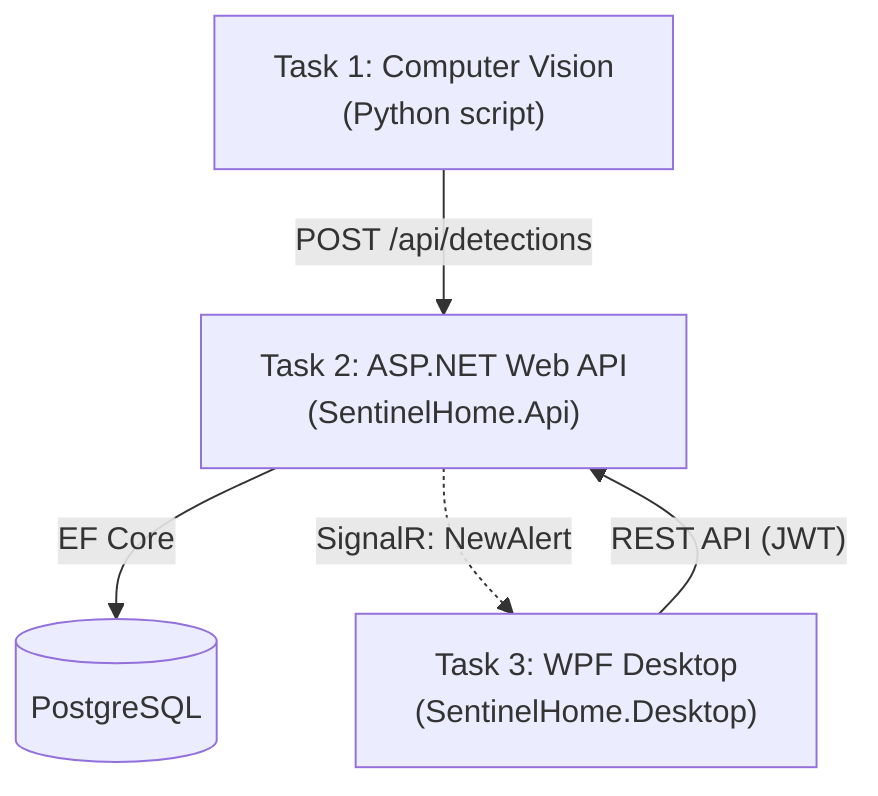

# SentinelHome — Thiết kế Task 2 (ASP.NET Web API)

**Công nghệ:** ASP.NET Core Web API + EF Core (Npgsql) + SignalR + JWT

## 1. Tổng quan kiến trúc

Task 2 là trung tâm của toàn hệ thống — vừa **nhận** dữ liệu từ Task 1, vừa **cung cấp API** cho Task 3.



## 2. Cấu trúc project

```
backend/
  SentinelHome.Data/       (EF Core entities + DbContext; không được frontend tham chiếu)
  SentinelHome.Api/        (Task 2 — ASP.NET Core Minimal API)
  ├─ Controllers/          (hoặc Endpoints/ nếu dùng Minimal API)
  ├─ Dtos/
  ├─ Services/
  │   ├─ DetectionIngestService.cs   (logic debounce + lưu event)
  │   ├─ AuthService.cs              (login, tạo JWT)
  │   └─ AlertNotifier.cs            (gửi qua SignalR)
  ├─ Hubs/
  │   └─ AlertsHub.cs
  └─ Program.cs
shared/
  SentinelHome.Contracts/  (DTO + enum dùng chung cho HTTP/SignalR)
frontend/
  SentinelHome.Desktop/    (Task 3 — WPF client độc lập)
```

`SentinelHome.Api` reference `SentinelHome.Data` để dùng lại entity + DbContext. `SentinelHome.Desktop` **không** reference Data/DbContext; nó chỉ gọi API và dùng DTO từ `SentinelHome.Contracts`.

## 3. Package cần cài

```bash
dotnet add package Npgsql.EntityFrameworkCore.PostgreSQL
dotnet add package Microsoft.EntityFrameworkCore.Design
dotnet add package Swashbuckle.AspNetCore
dotnet add package Microsoft.AspNetCore.Authentication.JwtBearer
dotnet add package BCrypt.Net-Next
```

## 4. Xác thực (JWT)

- `POST /api/auth/login` — kiểm tra `Username` + `PasswordHash` (dùng `BCrypt.Verify`), trả về JWT chứa claims `UserId`, `Username`, `Role`.
- Middleware `[Authorize]` áp dụng cho hầu hết endpoint, **trừ** `/api/health`, `/api/auth/login`, `/api/detections` (Task 1 không có cơ chế đăng nhập).
- `[Authorize(Roles = "Admin")]` cho các endpoint quản lý cấu hình (species CRUD, alert-settings PUT).

## 5. Danh sách endpoint

| Method | Route | Mục đích | Yêu cầu đăng nhập? |
|---|---|---|---|
| GET | `/api/health` | Kiểm tra Task 2 đã sẵn sàng chưa | Không |
| POST | `/api/auth/login` | Đăng nhập, trả về JWT token | Không |
| POST | `/api/detections` | Nhận JSON detection từ Task 1 | Không |
| GET | `/api/events` | Danh sách sự kiện (lọc, phân trang) | Có |
| GET | `/api/events/{id}` | Chi tiết 1 sự kiện | Có |
| GET | `/api/events/{id}/image` | Ảnh bằng chứng | Có |
| PUT | `/api/events/{id}/acknowledge` | Đánh dấu đã xem | Có |
| GET | `/api/species` | Danh sách watchlist | Có |
| POST / PUT | `/api/species/{id}` | Thêm/sửa loài | Có (Admin) |
| DELETE | `/api/species/{id}` | Soft-delete (set `IsActive = false`) | Có (Admin) |
| GET / PUT | `/api/alert-settings` | Xem/sửa cấu hình cảnh báo | Có (Admin) |
| GET | `/api/dashboard` | Gộp stats + camera-status trong 1 lần gọi | Có |
| Hub | `/hubs/alerts` | Đẩy real-time cảnh báo mới (SignalR) | Có |

## 6. Logic xử lý chính: `POST /api/detections`

1. Parse JSON body → `DetectionRequestDto`.
2. Convert `CapturedAt` (giờ Việt Nam trong JSON gốc) sang UTC trước khi lưu.
3. Với mỗi vật thể trong payload: đối chiếu `Species` watchlist theo tên + `ConfidenceThreshold`.
4. Tìm sự kiện gần nhất (cùng loài nguy hiểm nhất) trong vòng `AlertSettings.DebounceWindowSeconds` → nếu có, event mới set `IsDuplicate = true`, `OriginalEventId` trỏ về event gốc (nén đường dẫn nếu event trước đó cũng là duplicate).
5. Tính `OverallDangerLevel` = mức nguy hiểm cao nhất trong các `DetectedObject` của event.
6. Nếu event **không** duplicate VÀ `OverallDangerLevel` ≥ `AlertSettings.MinDangerLevelToTrigger` VÀ `AlertSettings.IsEnabled` → set `WasAlerted = true`, `AlertedAt = UtcNow`.
7. Lưu `DetectionEvent` + `DetectedObjects` (+ `EvidenceImages` nếu có ảnh kèm theo — xem lưu ý ở mục 8).
8. Nếu `WasAlerted` → gọi `AlertsHub.Clients.All.SendAsync("NewAlert", eventDto)`.

## 7. SignalR Hub

- `AlertsHub` map tại `/hubs/alerts`.
- Method server → client: `"NewAlert"`, payload là `EventSummaryDto`.
- WPF client kết nối tới hub ngay sau khi đăng nhập thành công, gắn JWT vào query string lúc handshake (`?access_token=...`) vì SignalR không dùng header `Authorization` được cho WebSocket.

## 8. Giới hạn đã biết / để dành cho tương lai

| Vấn đề | Trạng thái |
|---|---|
| Không đồng bộ lại cảnh báo bị lỡ khi WPF đang tắt/mất kết nối lúc sự kiện xảy ra | Đã quyết định **không làm** ở giai đoạn này — chỉ phù hợp khi app WPF chạy liên tục xuyên suốt lúc demo |
| `POST /api/detections` không yêu cầu xác thực | Chấp nhận được cho demo; nếu triển khai thật nên đổi sang xác thực bằng API key riêng cho Task 1 |
| JSON gốc từ Task 1 (theo tài liệu) chỉ có `bbox` tọa độ, chưa rõ có gửi kèm ảnh thật hay không | **Cần thống nhất với người làm Task 1**: ảnh gửi kèm dạng base64 trong JSON, hay Task 1 lưu file rồi Task 2 tự đọc theo đường dẫn? Ảnh hưởng trực tiếp tới cách implement bước 7 ở mục 6 |

## 9. Bước tiếp theo

1. Scaffold project `SentinelHome.Api`, reference `SentinelHome.Data`.
2. Implement `DetectionIngestService` (logic ở mục 6) — đây là phần quan trọng nhất, nên làm trước.
3. Implement JWT auth (`AuthService` + middleware).
4. Implement `AlertsHub`.
5. Bật Swagger, tự test từng endpoint bằng JSON mẫu trước khi có Task 1/Task 3 thật.
