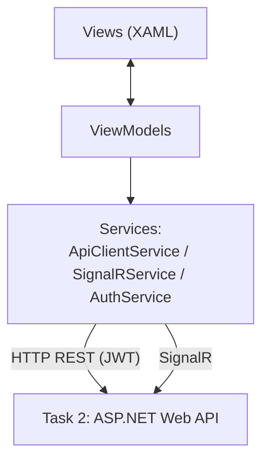

# SentinelHome — Thiết kế Task 3 (Giao diện WPF)

**Công nghệ:** WPF + MVVM + HttpClient + SignalR Client

## 1. Tổng quan kiến trúc

Task 3 **không** truy cập trực tiếp `SentinelHome.Data`/PostgreSQL — toàn bộ dữ liệu lấy qua API của Task 2.



## 2. Cấu trúc project

```
frontend/
  SentinelHome.Desktop/    (chỉ Task 3 — WPF client)
  Views/
    LoginView.xaml
    MainWindow.xaml           (shell + navigation)
    DashboardView.xaml
    HistoryView.xaml
    EventDetailView.xaml      (dialog)
    SettingsView.xaml
    AlertPopupWindow.xaml
  ViewModels/
    LoginViewModel.cs
    MainViewModel.cs
    DashboardViewModel.cs
    HistoryViewModel.cs
    EventDetailViewModel.cs
    SettingsViewModel.cs
    AlertPopupViewModel.cs
  Models/                     (DTOs khớp với Dtos/ bên Task 2)
  Services/
    ApiClientService.cs
    SignalRService.cs
    AuthService.cs
  Converters/
    DangerLevelToColorConverter.cs
  App.xaml.cs
shared/
  SentinelHome.Contracts/  (DTO/enum dùng chung; không chứa DbContext)
backend/
  SentinelHome.Api/        (Task 2 — API duy nhất được WPF gọi)
```

`SentinelHome.Desktop` tuyệt đối không reference `SentinelHome.Data`, không dùng Npgsql và không truy cập PostgreSQL. Điều này giữ frontend/backend tách rời đúng yêu cầu.

## 3. Package cần cài

```bash
dotnet add package CommunityToolkit.Mvvm
dotnet add package Microsoft.AspNetCore.SignalR.Client
```

`System.Net.Http.Json` đã có sẵn trong .NET 8, không cần cài thêm — dùng để gọi API và parse JSON tiện hơn `HttpClient` thuần.

`CommunityToolkit.Mvvm` giúp giảm code boilerplate của MVVM (`ObservableObject`, `[RelayCommand]`, `[ObservableProperty]`) — không bắt buộc nhưng giúp code gọn hơn nhiều so với viết `INotifyPropertyChanged` tay.

## 4. Chi tiết từng màn hình

### 4.1. Đăng nhập — `LoginView`

| UI | Gọi API | Map dữ liệu |
|---|---|---|
| Ô Username, Password, nút Đăng nhập | `POST /api/auth/login` | `Users.Username`, `Users.PasswordHash` (xác thực phía server) |

Đăng nhập thành công → `AuthService` lưu JWT token trong bộ nhớ (không ghi ra đĩa để tránh lộ token) → mở `MainWindow`, đóng `LoginView`.

### 4.2. Khung chính — `MainWindow` (shell)

- Menu điều hướng: **Dashboard | Lịch sử | Cấu hình** (ẩn mục "Cấu hình" nếu `Role != Admin`, lấy từ claim trong JWT).
- Thanh trạng thái: icon thể hiện SignalR đang kết nối hay mất kết nối.
- Lắng nghe sự kiện `"NewAlert"` từ `SignalRService` xuyên suốt vòng đời app → mở `AlertPopupWindow`, phát âm thanh nếu `AlertSettings.IsSoundEnabled`, tăng badge số cảnh báo chưa xem trên menu "Lịch sử".

### 4.3. Dashboard — `DashboardView`

Nguồn dữ liệu: `GET /api/dashboard`

| Thành phần UI | Lấy từ |
|---|---|
| Trạng thái camera (online/offline) | Suy ra: có event nào trong N giây gần nhất theo `CameraId` không |
| Card "Sự kiện hôm nay" | Đếm `DetectionEvents` theo ngày hiện tại |
| Card "Cảnh báo chưa xem" | Đếm `WasAlerted = true AND IsAcknowledged = false` |
| Danh sách 5 sự kiện gần nhất | `DetectionEvents` sắp `CapturedAt` giảm dần, lấy 5 |
| Biểu đồ nhỏ theo giờ | Group theo giờ trong ngày |

Tự động cập nhật khi `MainWindow` nhận `"NewAlert"` — không cần polling.

### 4.4. Lịch sử — `HistoryView`

Nguồn dữ liệu: `GET /api/events` (có filter + phân trang)

- `DataGrid` các cột: Ngày giờ (`CapturedAt`), Loài chính (loài có `IsDangerMatch = true` trong `DetectedObjects`), Mức độ (`OverallDangerLevel` — hiện badge màu đỏ/vàng/xanh), Trạng thái (`IsAcknowledged` — dòng chưa xem in đậm/có chấm đỏ).
- Thanh lọc phía trên: `DatePicker` (từ–đến), `ComboBox` mức độ nguy hiểm, `CheckBox` "chỉ hiện chưa xem".
- Click 1 dòng → mở `EventDetailView` dạng dialog.
- **Không load `ImageData` trong danh sách** (xem lưu ý hiệu năng đã thống nhất trước đó) — chỉ load ảnh khi mở chi tiết.

### 4.5. Chi tiết sự kiện — `EventDetailView` (dialog)

Nguồn dữ liệu: `GET /api/events/{id}` + `GET /api/events/{id}/image`

- Ảnh full frame lớn ở giữa; vẽ đè khung đỏ bounding box lên trên bằng `Canvas` (tọa độ lấy từ `BBoxX/Y/Width/Height` của từng `DetectedObject`).
- Danh sách vật thể bên cạnh ảnh: tên loài (`Species.DisplayNameVi` nếu có, không thì `SpeciesNameRaw`), độ tin cậy (`Confidence` dạng %), badge "Nguy hiểm" nếu `IsDangerMatch = true`.
- Nếu `IsDuplicate = true` → hiện dòng "Đã gộp từ sự kiện gốc lúc [giờ]" kèm link mở `OriginalEventId`.
- Nút "Đánh dấu đã xem" (ẩn nếu đã `IsAcknowledged`) → gọi `PUT /api/events/{id}/acknowledge`.

### 4.6. Cấu hình — `SettingsView` (chỉ Admin)

**Tab Watchlist**: `DataGrid` `Species` (`Name`, `DisplayNameVi`, `DangerLevel`, `ConfidenceThreshold`, `IsActive`) — nút Thêm/Sửa gọi `POST`/`PUT /api/species/{id}`, nút Tắt gọi `DELETE /api/species/{id}` (soft-delete, chỉ set `IsActive = false`, không xóa cứng — giữ toàn vẹn dữ liệu lịch sử).

**Tab Cảnh báo**: Form chỉnh `AlertSettings` — `IsEnabled` (toggle), `MinDangerLevelToTrigger` (ComboBox), `IsSoundEnabled` (toggle), `DebounceWindowSeconds` (số nguyên) — gọi `PUT /api/alert-settings` khi lưu.

### 4.7. Popup cảnh báo — `AlertPopupWindow`

Kích hoạt khi `SignalRService` nhận `"NewAlert"`.

- Hiện ở góc màn hình (giống Windows notification), không chiếm `Owner` là `MainWindow` để không chặn thao tác khác.
- Nội dung: ảnh thumbnail, tên loài nguy hiểm nhất, độ tin cậy, giờ phát hiện (`CapturedAt`).
- 2 nút: "Xem chi tiết" (mở `EventDetailView`) / "Đã xem" (gọi acknowledge trực tiếp từ popup).
- Nếu event có nhiều vật thể → chỉ hiện loài nguy hiểm nhất + dòng nhỏ "+N loài khác".
- Tự ẩn sau vài giây nếu không tương tác (không tự động set `IsAcknowledged` — chỉ ẩn UI, dữ liệu vẫn nằm trong "Lịch sử" để xem lại).

## 5. Bảng tổng hợp: màn hình ↔ API ↔ bảng dữ liệu

| Màn hình | API gọi | Bảng dữ liệu liên quan |
|---|---|---|
| Đăng nhập | `POST /api/auth/login` | `Users` |
| Dashboard | `GET /api/dashboard` | `DetectionEvents`, `DetectedObjects` |
| Lịch sử | `GET /api/events` | `DetectionEvents`, `DetectedObjects` |
| Chi tiết sự kiện | `GET /api/events/{id}`, `GET /api/events/{id}/image` | `DetectionEvents`, `DetectedObjects`, `Species`, `EvidenceImages` |
| Cấu hình — Watchlist | `GET/POST/PUT/DELETE /api/species` | `Species` |
| Cấu hình — Cảnh báo | `GET/PUT /api/alert-settings` | `AlertSettings` |
| Popup cảnh báo | SignalR `"NewAlert"` | `DetectionEvents` |

## 6. Bước tiếp theo

1. Scaffold project `SentinelHome.Desktop` (WPF, .NET 8).
2. Viết `ApiClientService` + `AuthService` trước — mọi ViewModel khác đều phụ thuộc vào 2 service này.
3. Viết `LoginView` + `MainWindow` (shell) để có khung điều hướng cơ bản.
4. Viết `SignalRService`, test kết nối tới `/hubs/alerts` bằng dữ liệu giả từ Swagger (Task 2) trước khi có Task 1 thật.
5. Lần lượt code `DashboardView` → `HistoryView` → `EventDetailView` → `SettingsView`.
